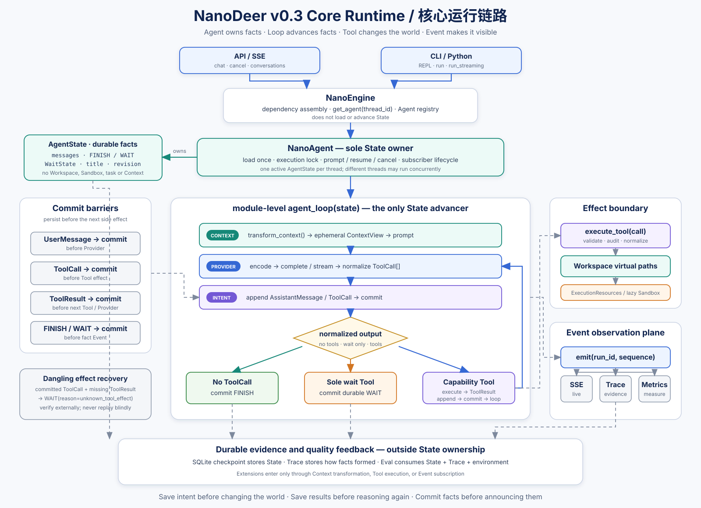

<div align="center">

# NanoDeer

**面向 Agent Runtime 工程的开源参考实现**

[](LICENSE)
[](https://python.org)
[](https://fastapi.tiangolo.com)
[](https://docker.com)

ReAct 循环 · Coding · Research · Office · Daily · 持久化 WAIT

*探索 LLM Agent 背后的运行时。*

[English](./README.md) | 中文

</div>

---

NanoDeer 是 **Agent Runtime 工程的开源参考实现**——不是又一个跟 Claude Code、Cursor 竞争的工具，而是把 Agent 运行时拆开、展示每个核心模式是怎么实现的。

它的核心是一条直白的 ReAct 循环，没有中间件链、没有图编排、没有框架锁。Coding、Research、Office、Daily 只是可组合的 Profile（Tools + Skills + Prompt），不是四套 Agent 或 Workflow。Subagent、Plan、Wiki 和分层记忆仍作为外接模块保留。

---

## 背景

去年底我开始接触 agent 相关的工作，那时候理解还很粗糙——无非就是 AI 帮你做事。三月初导师提到 "harness engineering 最近挺热的，可以看看"，我开始找资料，同时用上了 Claude Code。

三月下旬 **DeerFlow** 进入视野。字节跳动的开源项目第一次让我看到企业级 Agent harness 框架应该是什么样子——状态机、middleware 链、沙箱隔离、分级记忆，每个组件都在对的位置上。

故事可能到这里就结束了。但三月的最后一个晚上，我去听了字节的校招宣讲。宣讲中有一句话印象很深——*"和优秀的人做有挑战的事。"* 宣讲期间手机亮了一下——**Claude Code** 开源了。那一瞬间很多事串起来了：DeerFlow 告诉我框架该长什么样，Claude Code 告诉我产品可以是什么体验，那时 **OpenClaw** 也在国内热度也很高。当晚回到宿舍，我写下了第一版设计的想法。

**核心想法**：把那些验证过的模式提炼出来——原生 ReAct 循环、Docker 沙箱隔离、分级记忆、内联编排——收拢到一个聚焦、可审计的基础上，每个模块只有一个职责，横切逻辑内联处理。

---

## 设计思想

### 1. 没有中间件链

大多数 Agent 框架把横切关注点做成 pre/post 钩子。NanoDeer **完全没有中间件链**——核心只有一条状态推进链和几个小函数边界：

| 关注点 | 实现 |
|--------|------|
| 状态所有权 | 每个 thread 一个 `NanoAgent` + execution lock |
| 上下文加载 | `transform_context()` — 临时模型视图 |
| Workspace 边界 | 不可变 `Workspace` + thread 绑定虚拟路径 |
| 沙箱生命周期 | `SandboxManager.acquire()/release()` — 执行工具按需懒加载 |
| 工具副作用 | `execute_tool()` — 校验、审计、backend、结果归一化 |
| LLM 重试 | `_call_with_retry()` — 指数退避 |
| 外部输入 | 显式 `wait` 控制工具 + 可持久化 `WaitState` |
| 收敛保护 | 重复工具调用上限 + 最大轮数限制 |

这意味着你只需要读 [loop.py](src/nanodeer/agent/loop.py) 一个文件就能理解整个执行流程，不需要学任何图 DSL。

### 2. 核心 + 外接分层

项目明确分为两层：

- **核心**：ReAct 循环、State 所有权、Workspace、工具边界、检查点和 SSE API
- **执行后端**（可选/懒加载）：bash 使用 Docker；Local 执行必须显式进入 trusted mode
- **Profile**（启动时组装）：coding、research、office、daily 的 Tools + Markdown Skills
- **外接**（硬盘保留，不默认加载）：subagent、plan、wiki、记忆分层和额外工具模式

早期版本所有功能默认全加载。这次重构清理后，探索成果不浪费，只是不放在关键路径上。需要的人可以手动启用。

### 3. 为什么只有 bash 走沙箱

文件工具（read/write/edit）统一通过 thread-bound 虚拟 Workspace 运行。只有真正调用 bash 时才懒加载 Docker，并把同一份持久目录挂进容器；普通 LLM、Context 和文件操作都不会探测 Docker。除非显式启用 trusted Local mode，否则不会回退到宿主机 shell。

### 4. 为什么用扁平文件记忆

原来的 L1-L4 分层记忆模型（episodic → semantic → wiki → user）概念很漂亮，但复杂度超过了实用价值。简化版只用两个文件：`USER.md` 存偏好，`MEMORY.md` 存事实。分层模型作为外接模块保留。

### 5. 为什么 ToolManager 换成字典

原来的 `ToolManager` + `groups.py` 用来做渐进工具暴露（先给 4 个核心工具，通过 `request_tools()` 解锁更多）。这个机制解决了一个对现代 LLM 来说不存在的问题——它们处理 20 个工具毫无压力。字典查找更简单、零依赖、一眼能看懂。

### 6. 为什么 factory 合并进 engine

`NanoDeerFactory` 只是个薄参数转发层。现在由 `NanoEngine` 通过 `create_agent_loop()` 绑定依赖，并把得到的 callable 直接交给每个 `NanoAgent`；Agent 与 Loop 之间不再存在 executor 对象或另一套 run API。

### 7. 参考实现，不是产品

这是最重要的决定。NanoDeer 不跟 Claude Code、Cursor、Aider、Continue 竞争。它的存在意义是**被阅读**——展示 Agent 运行时怎么工作、可以被 fork 和修改、可以作为教学材料。价值在于代码的清晰程度和每个设计选择背后的推理，不在于功能数量。

---

## 核心架构



```
                      ┌──────────────────────────────┐
                      │      CLI / API / SSE           │
                      │  cli/api.py · cli/repl.py     │
                      └──────────┬───────────────────┘
                                 │
                      ┌──────────▼───────────────────┐
                      │  NanoEngine (engine.py)       │
                      │  — 依赖组装                   │
                      │  — get_agent(thread_id)      │
                      └──────────┬───────────────────┘
                                 │
                      ┌──────────▼───────────────────┐
                      │  NanoAgent 持有 AgentState    │
                      │  — execution lock             │
                      │  — prompt / resume / cancel   │
                      └──────────┬───────────────────┘
                                 │
                      ┌──────────▼───────────────────┐
                      │  agent_loop() (loop.py)       │
                      │ Context → Provider → Tool     │
                      │ commit → Event → FINISH/WAIT  │
                      └──────────────────────────────┘
```

**核心运行时模块：**

| 模块 | 展示的模式 | 行数 |
|------|-----------|------|
| `agent.py` | 每个 thread 的 State owner 与执行锁 | — |
| `loop.py` | 唯一主循环 | — |
| `state.py` | AgentState / FINISH / WAIT 事实 | — |
| `context.py` | Context 变换与上传边界 | — |
| `provider.py` | Provider 消息编解码与归一化 | — |
| `tooling.py` | 单一工具副作用边界 | — |
| `prompt.py` | Prompt 构建 | 196 |
| `llm.py` | LLM provider 抽象 | 41 |
| `sandbox/tools.py` | 沙箱包装 | 40 |
| `memory/storage.py` | 扁平文件记忆 | 97 |
| `checkpoint/sqlite.py` | SQLite 持久化 | 287 |
| `cli/api.py` | SSE 流式 API | ~336 |
| `config.py` | 运行时配置 | ~195 |

---

## 多功能能力

一个默认 Agent 可以在四类任务间自然切换，不经过领域 Router：

| Profile | 副作用边界 | Skill 工作流 |
|---|---|---|
| `coding` | Workspace 文件 + 沙箱 `bash` | 检查、修改、验证 |
| `research` | `web_search/web_fetch` + 带来源输出 | 来源核验与研究报告 |
| `office` | 一个 `office_artifact` 生成/反读 DOCX/XLSX/PPTX | 创建、检查、交付 |
| `daily` | 一个持久化 `tasks` + 扁平记忆 | 日期、待办与每日回顾 |

四类组合后共 16 个去重工具；单领域只有 7–10 个。Profile 只在 Loop 创建前组装，不写入 State。详见 [capabilities.md](docs/capabilities.md) 和 [tools_design.md](docs/tools_design.md)。

---

## 快速开始

### 环境要求
- Python ≥ 3.10
- 一个 LLM API Key（Anthropic、OpenAI、DeepSeek、MiniMax 等）
- Docker（可选，用于沙箱隔离）

### 安装

```bash
git clone https://github.com/gzhzk/nanodeer
cd nanodeer

cp .env.example .env
# 编辑 .env 填入 API Key

pip install -e .
```

### 启动（仅后端）

```bash
nanodeer          # 启动 API 服务 http://127.0.0.1:20266
nanodeer-repl     # CLI REPL 调试

# 可选：只启用部分能力
nanodeer --capabilities research,office
nanodeer-repl --capabilities daily
```

### 测试

```bash
pip install -e '.[dev]'
pytest
```

### 演示前端

基于 Next.js 的演示前端位于 `demo/frontend/`：

```bash
cd demo/frontend
npm install
npm run dev       # 打开 http://127.0.0.1:20265
```

---

## 项目结构

```
nanodeer/
├── pyproject.toml           # 构建配置 (hatchling)，入口点，依赖
├── config.yaml              # 运行时配置 (LLM providers, 沙箱, 存储)
├── config.yaml.example      # 模板 — 复制为 config.yaml 后编辑
├── .env / .env.example      # API 密钥
├── AGENTS.md                # Agent 开发指南 (Claude Code 上下文)
├── LICENSE                  # MIT
│
├── src/nanodeer/            # Python 源码
│   ├── __init__.py          # 包导出: NanoEngine, RuntimeFeatures, config
│   ├── engine.py            # NanoEngine — 应用入口，Loop 组装
│   ├── config.py            # HarnessConfig — Pydantic 模型，YAML + 环境变量加载
│   ├── profiles.py          # 四类 Profile 组合
│   │
│   ├── agent/               # 核心运行时
│   │   ├── __init__.py
│   │   ├── agent.py         # NanoAgent — State owner + execution lock
│   │   ├── loop.py          # 唯一 agent_loop + 依赖绑定函数
│   │   ├── state.py         # AgentState, NextAction, WaitState
│   │   ├── context.py       # ContextView + transform/上传边界
│   │   ├── provider.py      # Provider 编解码/归一化边界
│   │   ├── tooling.py       # execute_tool 副作用边界
│   │   ├── prompt.py        # PromptConfig, build_base/lead_agent_prompt
│   │   ├── llm.py           # ReasoningChatOpenAI (OpenAI 兼容包装)
│   │   ├── messages.py      # HumanMessage, AIMessage, ToolMessage, ToolCall
│   │   ├── trace.py         # TraceCollector — 结构化事件发射
│   │   ├── checkpoint/
│   │   │   ├── __init__.py
│   │   │   ├── base.py      # Checkpointer ABC
│   │   │   └── sqlite.py    # SqliteCheckpointer — 消息 + 元数据持久化
│   │   └── memory/
│   │       ├── __init__.py
│   │       └── storage.py   # MemoryStore — USER.md + MEMORY.md 扁平文件
│   │
│   ├── sandbox/             # 沙箱隔离
│   │   ├── __init__.py      # SandboxProvider ABC, Sandbox, RunResult, get/set/clear
│   │   ├── docker.py        # DockerSandboxProvider — 容器生命周期
│   │   ├── local.py         # LocalSandboxProvider — 子进程回退
│   │   ├── tools.py         # SandboxToolWrapper — 仅 bash，40 行
│   │   ├── runtime.py       # ExecutionResources + 沙箱 acquire/release
│   │   └── path.py          # 路径验证 (外接模块保留)
│   │
│   ├── tools/               # 内置工具定义
│   │   ├── __init__.py      # 工具导出 + 旧最小工具列表兼容
│   │   ├── read_file.py     # 核心: 读取文件
│   │   ├── write_file.py    # 核心: 写入文件
│   │   ├── edit_file.py     # 核心: 字符串替换编辑
│   │   ├── bash.py          # 核心: 执行 Shell 命令 (沙箱包装)
│   │   ├── web_search.py    # 核心: DuckDuckGo 搜索
│   │   ├── web_fetch.py     # 核心: 获取 URL 内容
│   │   ├── save_memory.py   # 核心: 写入 USER.md / MEMORY.md
│   │   ├── search_memory.py # 核心: 读取 USER.md / MEMORY.md
│   │   ├── office_artifact.py # DOCX/XLSX/PPTX 创建与反读
│   │   ├── tasks.py         # 持久化日常任务
│   │   ├── wait.py          # 核心: 显式、可持久化 WAIT 控制
│   │   ├── ls.py            # 外接: 列出目录
│   │   ├── glob.py          # 外接: 文件模式匹配
│   │   ├── grep.py          # 外接: 搜索文件内容
│   │   ├── git.py           # 外接: Git 操作
│   │   ├── exec_python.py   # 外接: 执行 Python 代码
│   │   ├── read_image.py    # 外接: 读取图片
│   │   ├── invoke_skill.py  # 外接: 加载技能工作流
│   │   ├── create_plan.py   # 外接: 创建计划
│   │   ├── plan_step.py     # 外接: 添加/更新计划步骤
│   │   ├── list_plans.py    # 外接: 列出计划
│   │   └── spawn_subagent.py # 外接: 派生/收集子代理
│   │
│   ├── cli/
│   │   ├── __init__.py
│   │   ├── api.py           # FastAPI 应用, SSE /api/chat, 会话 CRUD
│   │   └── repl.py          # 异步 CLI REPL 调试
│   │
│   ├── subagent/            # 外接: SubagentCoordinator, runner, types
│   └── plan/                # 外接: PlanStore, Plan/Step types
│
├── scripts/
│   ├── dev.sh               # 一键启动: 后端 (+ --with-frontend 演示前端)
│   └── check.sh             # 运行测试 (pytest)
│
├── tests/                   # Python 回归测试套件 (293 项)
│   ├── conftest.py          # 共享 fixtures
│   ├── test_agent/          # ReAct, engine, state, messages 等
│   ├── test_sandbox/        # Docker, 路径, 工具包装
│   ├── test_agent_memory/   # MemoryStore
│   ├── test_tools_integration/ # 工具集成测试
│   ├── test_subagents/      # 外接测试
│   ├── test_plan/           # 外接测试
│   ├── test_skills/         # 外接测试
│   ├── test_evaluation/     # 归档测试
│   └── test_cli/            # API 上传测试
│
├── demo/frontend/           # Next.js + assistant-ui 演示前端 (独立关注点)
├── evaluation/              # 评测框架 (归档)
└── docs/                    # 设计文档
    ├── harness_architecture.md
    ├── nanodeer_current_core_chain.svg
    ├── runtime_architecture.md
    ├── sandbox_design.md
    ├── tools_design.md
    ├── prompt_design.md
    ├── memory_design.md
    ├── nanodeer_blueprint_20260401.md
    ├── refactoring_journey.md
    └── archive/             # 已移除模块的文档归档
```

---

## 存储布局

```
~/.nanodeer/
├── memory/                    # 核心: 扁平文件记忆 (USER.md + MEMORY.md)
├── daily/tasks.json           # 持久化日常任务
├── threads/
│   ├── threads.db             # SQLite — 消息 + 元数据持久化
│   └── {thread_id}/
│       └── user-data/         # 挂载到沙箱容器的卷
│           ├── workspace/
│           ├── uploads/
│           └── outputs/
└── conversations/
    └── {thread_id}.json       # 前端索引 (标题, 时间戳)
```

外接模块 (subagent, plan, wiki, layers) 使用时会创建额外目录，但核心模块默认不引用它们。

---

## 致谢

感谢我的家人 —— 无声的支持和无限的耐心，让这一切成为可能。

感谢我的导师 —— 为我打开了 Agent 和 Harness Engineering 的大门，并鼓励我探索。

[Claude Code](https://claude.com/product/claude-code) —— 我最好的编程伙伴，让我的 AI 工作流程如虎添翼，并向我展示了产品可以既强大又优雅。

[DeerFlow](https://github.com/bytedance/deer-flow) —— 让我第一次看到企业级 Agent 框架应该是什么样子。

[OpenClaw](https://github.com/openclaw/openclaw) —— 分层记忆和 IM 渠道的灵感来源。

[NanoClaw](https://github.com/qwibitai/nanoclaw) —— Docker 沙箱隔离模式的启发。

[assistant-ui](https://github.com/assistant-ui/assistant-ui) —— 提供美观且可扩展的 React 聊天界面，驱动本项目的前端。

[DeepSeek](https://deepseek.com/) —— 提供 deepseek-v4-flash 模型，推理效率极高。

[MiniMax](https://www.minimaxi.com/) —— 提供驱动本项目的 MiniMax-M2.7 模型服务。

[Andrej Karpathy](https://github.com/karpathy) —— [LLM wiki](https://gist.github.com/karpathy/442a6bf555914893e9891c11519de94f) 概念的提出者，启发了本项目的 wiki 记忆系统：让 LLM 自主策展结构化知识库。

---

## 设计参考

| 来源 | 参考的模式 |
|------|-----------|
| **DeerFlow** | 状态机 + `next_action` 信号路由 |
| **Claude Code** | 工具优先设计、显式运行控制 |
| **OpenClaw** | 分层记忆、Wiki 结构化知识 |
| **NanoClaw** | Docker 沙箱、Volume mount、路径隔离 |

---

## License

MIT
